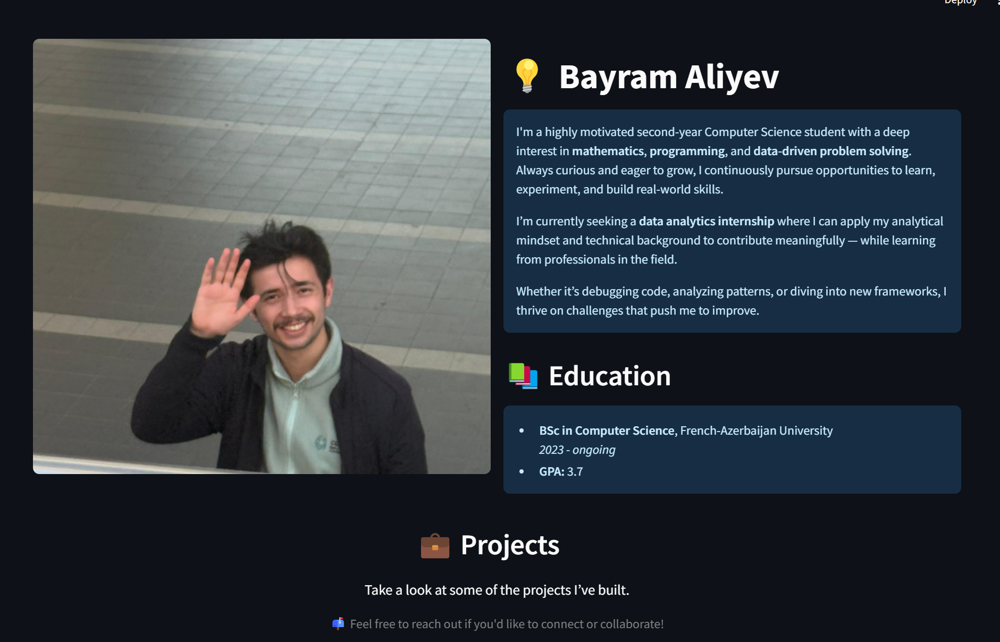
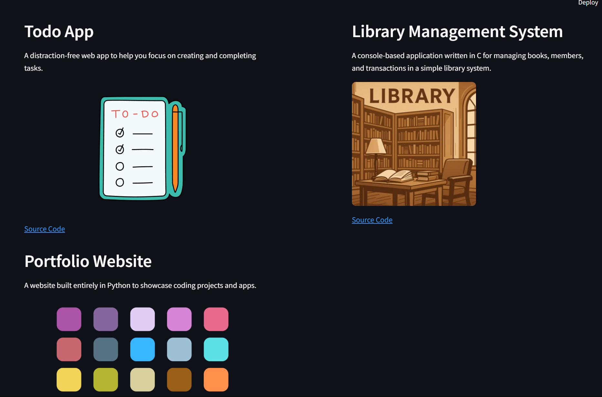

# 💡 Bayram Aliyev – Streamlit Portfolio
🔗 **Live Demo**: [Click here to view the portfolio](https://bayramaliyev-portfolio.streamlit.app)

Welcome to my interactive portfolio built with **Streamlit**! This web app showcases who I am, my educational background, selected projects, and includes a contact form that sends messages directly to my inbox via email.

---

## 🚀 About Me

I'm a highly motivated second-year Computer Science student with a deep interest in **mathematics**, **programming**, and **data-driven problem solving**.

I’m currently seeking a **data analytics internship** where I can apply my analytical mindset and technical background to contribute meaningfully — while learning from professionals in the field.

---

## 🧰 Tech Stack

- **Frontend & UI**: [Streamlit](https://streamlit.io)
- **Backend**: Python (SMTP for email handling)
- **Data Handling**: Pandas
- **Deployment**: Suitable for platforms like Streamlit Cloud

---

## 💼 Features

- ✨ Clean and responsive layout using Streamlit's column system
- 📷 Dynamic project showcase (loaded from `data.csv`)
- 📬 Contact form with secure email delivery using `smtplib` and environment variables
- 🔒 Secrets managed via environment variables (recommended for deployment)

---

## 📸 Screenshots


*The main homepage with profile and project highlights.*


*Dynamic project listings loaded from `data.csv`.*

---

## ⚙️ Setup & Installation

1. **Clone the repo**
   ```bash
   git clone https://github.com/your-username/your-repo.git
   cd your-repo

2. **Install dependencies**
   ```bash
   pip install -r requirements.txt

3. **Run the app**
   ```bash
   streamlit run Home.py

--- 


## 🛡️ Security Note

This app uses SMTP to send emails. To keep credentials safe:

- Use **environment variables** (not hard-coded values).
- If deploying on **Streamlit Cloud**, use **Secrets Manager**.
- Never upload sensitive info to public repositories.

We recommend enabling 2FA and using **app-specific passwords** for Gmail.

---

## 📫 Contact

Want to collaborate or just say hello? Feel free to use the contact form in the app or reach out directly:

- **Email:** aliyevbayram08@gmail.com
- **LinkedIn:** [linkedin.com/in/bayram-aliyev](https://www.linkedin.com/in/bayram-aliyev/)

---

## 📝 License

This project is open-sourced under the MIT License.